# Space Shooter

A 2D space shooter inspired by the classic arcade game **Space Invaders**, developed in **C# using MonoGame**.

## Description

**Space Shooter** is a modern take on the classic 1978 arcade game [Space Invaders](https://en.wikipedia.org/wiki/Space_Invaders).

The objective is simple: **destroy waves of invading enemies, survive as long as possible, and achieve the highest score.**

The game aims to stay close to the gameplay and spirit of the original Space Invaders while introducing additional features and improvements where appropriate.

### Objective

The player controls a spacecraft and must:

- Destroy incoming waves of enemies.
- Avoid enemy projectiles.
- Survive as long as possible.
- Progress through increasingly difficult waves.
- Achieve the highest possible score.
- Compete for a place on the local leaderboard.

### Gameplay

Enemies move across the screen in formations while periodically firing projectiles at the player.

The player can move their spacecraft and shoot enemies. Destroying enemies awards points, while surviving waves allows the player to progress through the game.

As the game progresses, the difficulty increases, creating a progressively more challenging experience inspired by the original arcade game.

---

## Features

- Player movement
- Shooting and combat
- Enemy formations
- Collision detection
- Score system
- Difficulty system
- Sound effects and music
- Main menu
- Pause system
- Save system
- Local leaderboard
- High-score archive
- Multiple waves
- MariaDB integration for score storage

---

## Technologies

- **C#**
- **MonoGame**
- **.NET 8**
- **Visual Studio 2022**
- **MariaDB**
- **MySqlConnector**
- **DotNetEnv**

---

## Requirements

### Development

To build the project from source, you will need:

- Windows
- [.NET 8 SDK](https://dotnet.microsoft.com/download/dotnet/8.0) or newer
- Visual Studio 2022 or newer
- MonoGame
- MariaDB Server
- Git

### Playing a Release

For a published release, you do **not** need to install MonoGame separately.

If the release is published as self-contained, .NET does not need to be installed either.

---

## Installation

### From Source

Clone the repository:

```bash
git clone https://github.com/Mommy-Of-Light/SpaceShooter.git
```

Enter the project directory:

```bash
cd SpaceShooter
```

Open the solution:

```text
SpaceShooter/SpaceShooter.sln
```

in Visual Studio.

Restore the required NuGet packages and build the project.

---

## MariaDB Setup

The game can run without a database, but **scores and leaderboard data will not be saved** without MariaDB.

The database structure is provided in:

```text
DATABASE.sql
```

### Database configuration

The game uses a local MariaDB server with the following configuration:

```env
DB_SERVER=localhost
DB_PORT=3306
DB_NAME=SpaceShooter
DB_USER=spaceshooter_app
DB_PASSWORD=your_password
```

The MariaDB user should be dedicated to the game and should only have permissions on the `SpaceShooter` database.

For development, configure your local `.env` file with the credentials of your MariaDB installation.

> **Note:** The `.env` file contains local database configuration. Do not use personal or production database credentials in the repository.

---

## Running the Game

### From the release version

Just double-click the `.exe` file to launch the game.

### For dev purpose

From Visual Studio, run the project using:

```text
F5
```

or:

```text
Ctrl + F5
```

The game will start using the configured MariaDB connection if one is available.

If the database is unavailable, the game can still run, but score persistence and leaderboard functionality will not be available.

---

## Controls

The game can be controlled using the keyboard or mouse. Keyboard controls are available throughout the menus, while the player controls the spaceship directly during gameplay.

### General Controls

| Key                  | Action                             | Screens affected                                            |
| -------------------- | ---------------------------------- | ----------------------------------------------------------- |
| **Up Arrow**         | Move selection up / scroll up      | Main Menu, New Game, Death, Upgrade, Archive, Save, Ranking |
| **Down Arrow**       | Move selection down / scroll down  | Main Menu, New Game, Death, Upgrade, Archive, Save, Ranking |
| **Enter**            | Confirm the selected option        | Main Menu, New Game, Death, Upgrade, Save                   |
| **Space**            | Confirm the selected option        | Main Menu, Death, Upgrade, Save                             |
| **Escape**           | Return to the previous menu / exit | Main Menu, New Game, Death, Archive, Ranking, Save          |
| **Mouse Left Click** | Select buttons and menu options    | All menu screens                                            |

### Player Controls

| Key                              | Action                  | Screen   |
| -------------------------------- | ----------------------- | -------- |
| **A** / **Left Arrow**           | Move spaceship left     | Gameplay |
| **D** / **Right Arrow**          | Move spaceship right    | Gameplay |
| **Space**                        | Fire weapon             | Gameplay |
| **Left Shift** / **Right Shift** | Slow spaceship movement | Gameplay |

The player is restricted to the horizontal boundaries of the game window and cannot move outside the playable area.

### Difficulty Selection

The difficulty can be selected directly using the number keys:

| Key                  | Action |
| -------------------- | ------ |
| **1** / **NumPad 1** | Easy   |
| **2** / **NumPad 2** | Medium |
| **3** / **NumPad 3** | Hard   |

The difficulty affects the game's difficulty multiplier:

- **Easy:** `0.5x`
- **Medium:** `1.0x`
- **Hard:** `2.0x`

### Ranking Controls

The ranking screen provides keyboard shortcuts for filtering scores:

| Key            | Action                  |
| -------------- | ----------------------- |
| **1**          | Display all scores      |
| **2**          | Display Easy scores     |
| **3**          | Display Medium scores   |
| **4**          | Display Hard scores     |
| **Up Arrow**   | Scroll ranking upward   |
| **Down Arrow** | Scroll ranking downward |
| **Escape**     | Return to the main menu |

The same controls are available using the corresponding **NumPad** keys.

### Upgrade Controls

When choosing a ship upgrade, the following shortcuts can be used:

| Key                   | Upgrade                                  |
| --------------------- | ---------------------------------------- |
| **1** / **NumPad 1**  | Increase missile attack speed            |
| **2** / **NumPad 2**  | Increase projectile pierce               |
| **3** / **NumPad 3**  | Increase the number of auto-aim missiles |
| **4** / **NumPad 4**  | Increase projectile damage               |
| **Up Arrow**          | Select the previous upgrade              |
| **Down Arrow**        | Select the next upgrade                  |
| **Enter** / **Space** | Confirm the selected upgrade             |

Unavailable upgrades are displayed as locked and cannot be selected.

### Pseudo Entry

When entering the player's pseudo:

| Key                   | Action                    |
| --------------------- | ------------------------- |
| **Letters / Numbers** | Enter characters          |
| **-**                 | Enter a hyphen            |
| **_**                 | Enter an underscore       |
| **Backspace**         | Delete the last character |
| **Enter**             | Confirm the pseudo        |

The pseudo can contain a maximum of **16 characters** and may only contain letters, numbers, `_`, and `-`.

### Save and Archive Controls

The **Save**, **Archive**, and related screens support keyboard navigation:

| Key            | Action                              |
| -------------- | ----------------------------------- |
| **Up Arrow**   | Move selection / scroll upward      |
| **Down Arrow** | Move selection / scroll downward    |
| **Enter**      | Load or confirm the selected option |
| **Space**      | Confirm the selected option         |
| **Escape**     | Return to the main menu             |

On the **Save** screen, saved games can also be deleted using the **Delete** buttons with the mouse.

### Mouse Controls

The mouse can be used to interact with buttons throughout the game's menus.

**Left Mouse Button:**
- Select menu options.
- Start or continue a game.
- Select difficulty.
- Choose upgrades.
- Load or delete saved games.
- Change ranking filters.
- Return to previous menus.

### Debug Controls

The following keyboard control is intended for development/debugging purposes:

| Key     | Action                    | Screen   |
| ------- | ------------------------- | -------- |
| **F12** | Toggle automatic shooting | Gameplay |

When enabled, automatic shooting fires the player's normal weapon periodically and automatically launches missiles when the required number of shots has been reached.

> **Note:** The F12 automatic shooting feature is a development/debugging feature and is not intended as a normal gameplay control.
> 
---

## Project Structure

```text
SpaceShooter/
├── Font/
├── Icons/
├── Screenshots/
├── SpaceShooter/
│   ├── SpaceShooter.slnx
│   └── SpaceShooter/
│       ├── Content/
│       │   ├── Fonts/
│       │   ├── Icons/
│       │   ├── Music/
│       │   ├── SoundEffects/
│       │   └── Textures/
│       │       └── PNG/
│       │           ├── Damage/
│       │           ├── Effects/
│       │           ├── Enemies/
│       │           ├── Lasers/
│       │           ├── Meteors/
│       │           ├── Parts/
│       │           ├── Power-ups/
│       │           └── UI/
│       ├── ArchiveData.cs
│       ├── ArchiveManager.cs
│       ├── ArchiveScreen.cs
│       ├── Boss.cs
│       ├── Button.cs
│       ├── Constants.cs
│       ├── DeathScreen.cs
│       ├── Enemy.cs
│       ├── Game1.cs
│       ├── GameData.cs
│       ├── GameScreen.cs
│       ├── MariaDbManager.cs
│       ├── MenuScreen.cs
│       ├── MusicPlayer.cs
│       ├── NewGameScreen.cs
│       ├── Player.cs
│       ├── PlayScreen.cs
│       ├── Program.cs
│       ├── Projectiles.cs
│       ├── RankingScreen.cs
│       ├── SaveData.cs
│       ├── SaveManager.cs
│       ├── SaveScreen.cs
│       ├── ScreenManager.cs
│       ├── SoundEffectPlayer.cs
│       ├── TrackSettings.cs
│       ├── UpgradeScreen.cs
│       └── WaveManager.cs
├── Sprites/
├── .gitignore
├── Cahier des charges.md
├── DATABASE.sql
├── Journal De Bord.md
├── LICENCE
├── Mandat.md
├── Plannif projet spaceshooter.xlsx
├── Questions au client.md
├── README.md
├── Suivi de projet.xlsx
└── Testes.md
```

---

## Screenshots

### Main Menu

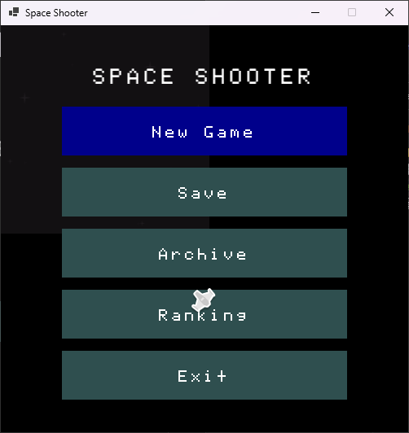

### Pseudo Menu

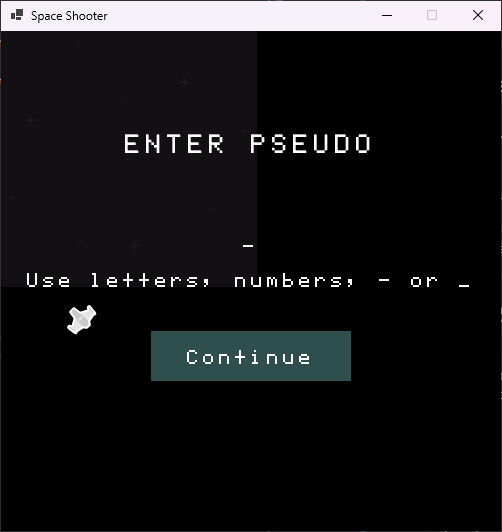

### New Game Menu

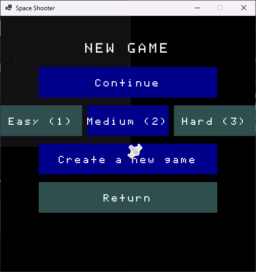

### New Game Menu — No Save

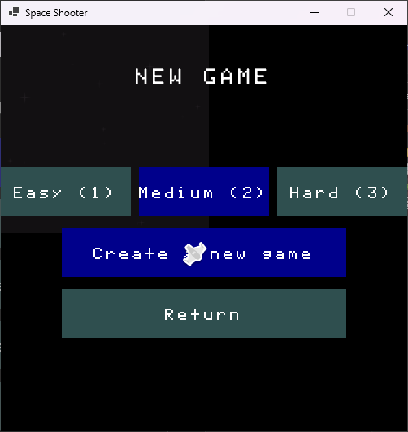

### Saves Menu

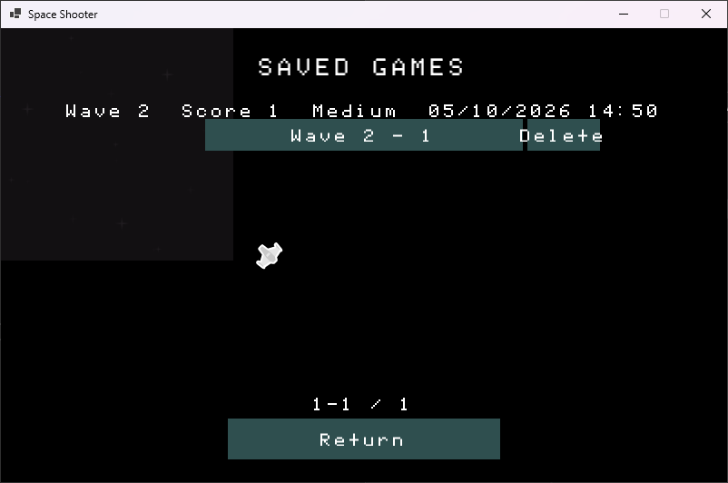

### Save Menu — No Saves

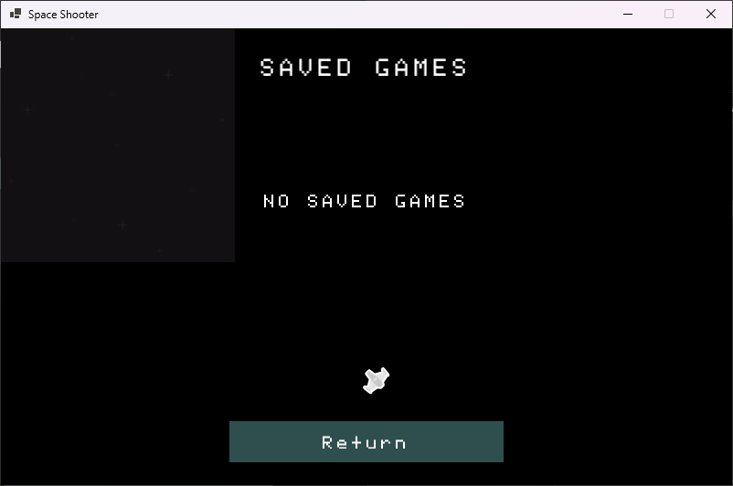

### Archive Menu

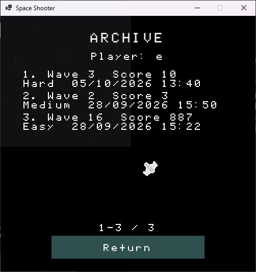

### Archive Menu — No Archives

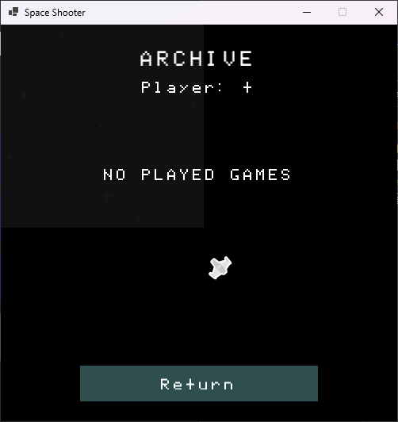

### Leaderboard — All Categories

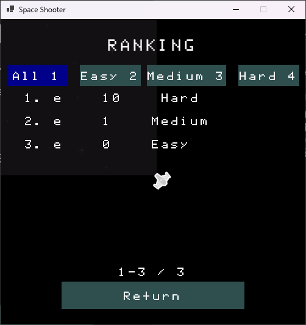

### Leaderboard — Easy

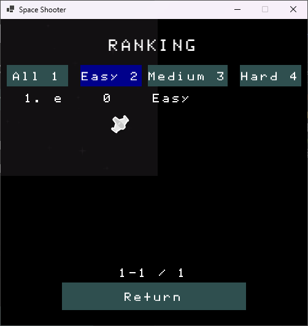

### Leaderboard — Medium

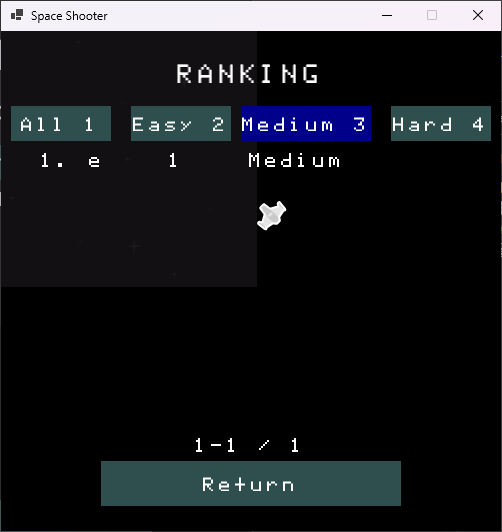

### Leaderboard — Hard

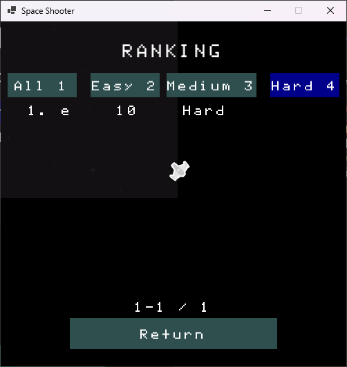

### Leaderboard — Empty Category

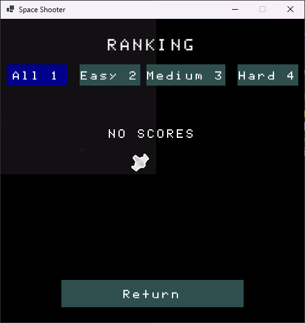

### Upgrade Menu

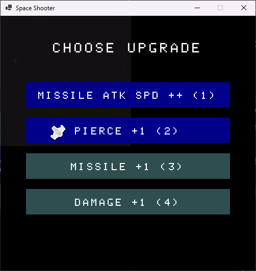

### Upgrade Menu — Locked Upgrade

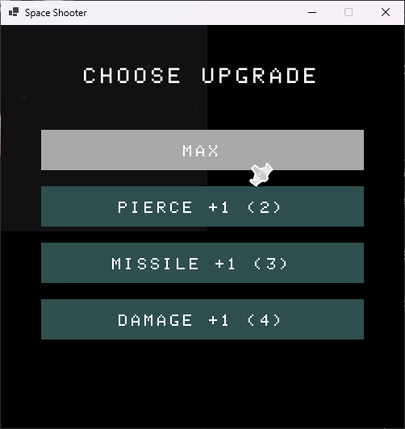

### Game Screen — Normal Wave

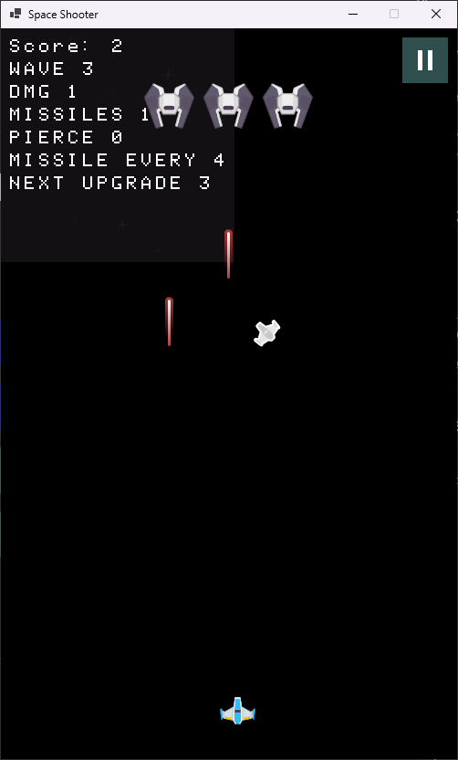

### Game Screen — Boss Battle

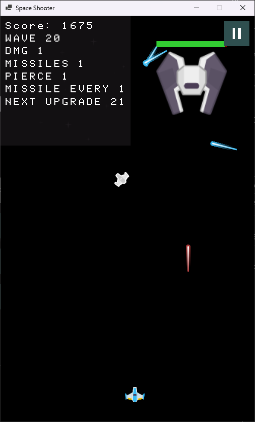

### Pause Menu Overlay

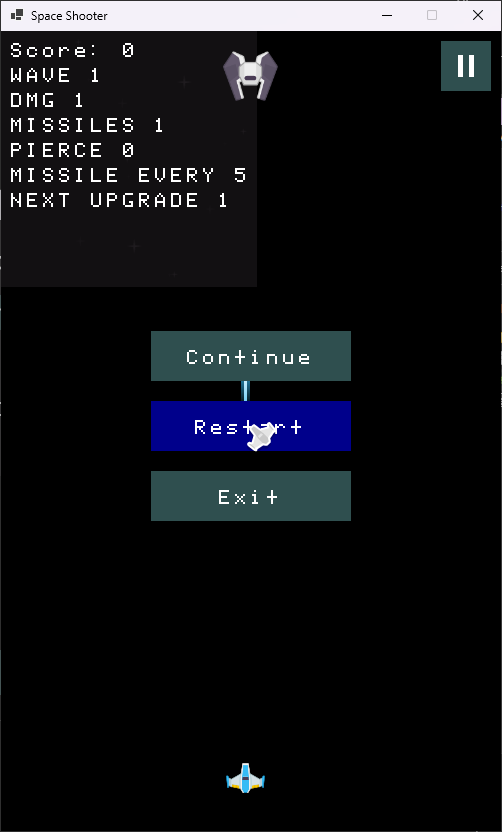

### Death Screen

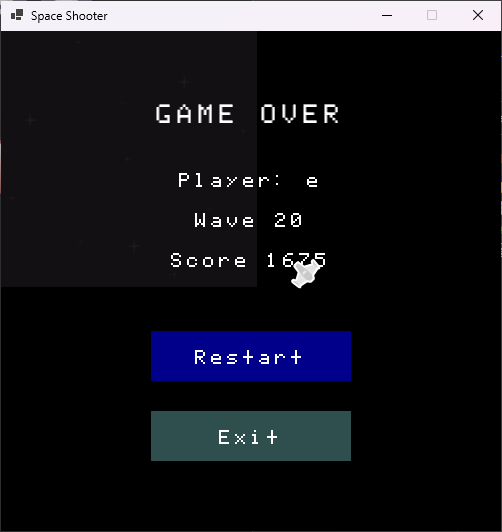

---

## Project Status

**In Development**

* [x] Project setup
* [x] Player
* [x] Basic movement
* [x] Enemies
* [x] Combat
* [x] Collision system
* [x] Scoring
* [x] Menus
* [x] Sound and music
* [x] Save system
* [x] Leaderboard
* [x] MariaDB integration
* [x] Testing
* [x] Additional difficulty modes
* [x] Boss fights
* [ ] Release

---

## Future Improvements

Possible future additions include:

* More enemy types
* New weapons
* More levels
* Improved enemy AI
* Power-ups
* Local high-score system
* Improved graphics
* Additional sound effects
* Controller support
* Additional game modes

---

## Contributor

**Mommy Of Light** — Developer

[empress.mommy.of.light@gmail.com](mailto:empress.mommy.of.light@gmail.com)

---

# Credits

## Music

### "The Aliens Are Coming!"

Sound effect/music by **Noah Hansen** via [Pixabay](https://pixabay.com/).

[The Aliens Are Coming!](https://pixabay.com/music/video-games-quotthe-aliens-are-comingquot-569390/)

### "Nebulous"

By **BossLevelVGM**, via [OpenGameArt](https://opengameart.org/content/nebulous).

Licensed under [CC BY 3.0](https://creativecommons.org/licenses/by/3.0/).

### "Wave After Wave!"

By **FoxSynergy**, via [OpenGameArt](https://opengameart.org/content/wave-after-wave).

Licensed under [CC BY 3.0](https://creativecommons.org/licenses/by/3.0/).

### "Spacey"

By **Joao Victor Pereira Vaz**.

Licensed under [CC BY-NC 4.0](https://creativecommons.org/licenses/by-nc/4.0/).

---

# Sound Effects

### Retro Laser Gun Shot

Sound effect by **freesound_community** via [Pixabay](https://pixabay.com/).

[Retro Laser Gun Shot](https://pixabay.com/sound-effects/film-special-effects-retro-laser-gun-shot-96367/)

### Snare Space Shot

Sound effect by **freesound_community** via [Pixabay](https://pixabay.com/).

[Snare Space Shot](https://pixabay.com/sound-effects/film-special-effects-snare-space-shot-80932/)

### Space Zap

Sound effect by **u_zryegfa0xr** via [Pixabay](https://pixabay.com/).

[Space Zap](https://pixabay.com/sound-effects/film-special-effects-space-zap-217411/)

---

# Sprites

**Space Shooter Redux** by **Kenney Vleugels**.

[Kenney - Space Shooter Redux](https://kenney.nl/assets/space-shooter-remastered)

---

## Licence

This project is licensed under the **MIT Licence**.

See the [LICENCE](./LICENCE) file for more information.
